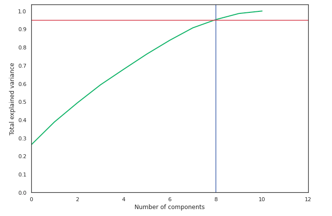

# BUILDING RECOMMENDATION SYSTEM FOR SPOTIFY PLAYLIST

 ## Objective :
  Given a playlist of Spotify tracks, our objective is to build a recommendation system that is be able to recommend a list of tracks that would constitue an appropriate extension of the playlist.

 ## Data collection and Preprocessing : 
 We us the  Spotify Million PLaylist Dataset (MPD). The file structure consists of 10,000 .json subfiles, with each subfile containing 1,000 playlists.Apart from the existing attributes for each song we extracted a few more features using the Spotify API.The Spotify API takes the track ids and an authentication token as input and ultimately provides various features. So, finally each track in the dataset includes the following attributes:
 -  Album name
 -  ID
 -  Artist
 -  Track duration
 -  Track name
 -  Danceability
 -  Instrumentalness 
 -  Loudness
 -  Speechiness 
 -  Valence
 -  Energy
 -  Mode 
 -  Tempo
 -  Liveness 
 -  Key 
 -  Acousticness
 

 ## Models :
 
 ### Nearest Neighbour based approach  :
This is our baseline approach. We used song to song similarity here. Initailly, in the dataset, we performed PCA with eight components as that was needed for retaining 95% variance. After PCA, we used cosine similarity as the metric on the numeric features.For a given set of tracks, we generated the recommended tracks as the ones having the highest cosine similarity value.In order to inject some randomness in the recommendation, for every set of recommended tracks we added a track randomly without bothering about the cosine similarity values. This increases the diversity of our recommendation.\
**Limitations** 
1. Doesn't take into account the features like artist name, album name etc. which when considered, would produce better recommendations.
2. Scalability becomes difficult as we need to calculate distance to every other track for each new input track given.

 ### Collaborative Filtering based approach : 
Collaborative filtering was the next approach.

**Limitaions** 
1. Poor scalability.
2. Only based on Playlist-Song matrix. Doesnt consider the artist-song features. 

### Neural Collaborative Filtering
Out of the previous two models, we found the CF based approach better and decided to improve upon that. In the Baseline Collaborative Filtering model we only have onehot vectors for each song . Here , we initialised the SongsEmbedding matrix in neural network with features from Spotify.The use of sparse matrix provided poor scalability.Here since we use vector representaion for songs including the features from Spotify API, this model is scalable.Also, we train SongsEmbedding with respect to artists .So,the final recommendations are based on  ensemble of vector respresentations obtained from Playlist-Song training and Artist-Song Training.Also, we introduce negative sampling to reduce computational overhead.

 ## Evaluation metric : 
 Since there is no definite metric to evaluate the recommendations, we devised a metric which is as follows :
 - If the recommended track's Artist or Album name matches with that of the given input track(s), it is considered to be a good recommendation.
 - The difference between the values of the features of the recommended track and the given input track is less than a specified threshold (0.2), and this is true for six out of the eleven features that we use, the recommended track is considered to be a good one.
 
## User Interface : 
We use a flask based user interface to the model. Threaded parameter of interface allows us to make multiple request to the model simultaneously. UI is based on python flask with support of html and jinja2 templates. Jinja2 is template engine which allows user to have dynamic html content.

### Team :
Meenu Menon\
Yash Upadhyay\
Lalitha Kameswari\
Dama Sravani

